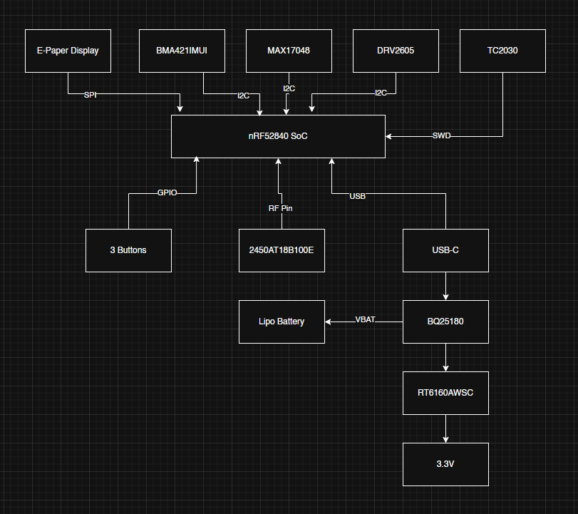

# Proiect-InkTime
## 1. Diagrama Bloc a Sistemului
Diagrama de mai jos arata cum sunt conectate componentele principale la microcontroller-ul nRF52840:

- **Alimentare:** USB-C -> BQ25180 (Charger) -> Baterie LiPo 400mAh.
- **Afisaj:** Ecran E-Paper 1.54 inch (Conectat prin SPI).
- **Senzori:** Accelerometru BMA423 (Conectat prin I2C).
- **Haptica:** Driver DRV2605 + Motor Vibratii (Conectat prin I2C).
- **Interactiune:** 3 Butoane Tactile (Conectate prin GPIO).

## 2. Bill of Materials (BOM)
Componente selectate din catalogul JLCPCB:

| Componenta | Producator | JLC Part Number | Datasheet |
| :--- | :--- | :--- | :--- |
| MCU nRF52840 | Nordic Semi | C190733 | [Datasheet](https://infocenter.nordicsemi.com/pdf/nRF52840_PS_v1.0.pdf) |
| Senzor BMA423 | Bosch | C404044 | [Datasheet](https://www.bosch-sensortec.com/media/boschsensortec/downloads/datasheets/bst-bma423-ds004.pdf) |
| Charger BQ25180 | TI | C2907481 | [Datasheet](https://www.ti.com/lit/ds/symlink/bq25180.pdf) |
| Driver DRV2605L | TI | C63523 | [Datasheet](https://www.ti.com/lit/ds/symlink/drv2605l.pdf) |
| Antena 2.45GHz | Johanson | C105252 | [Datasheet](https://www.johansontechnology.com/datasheets/2450AT18B100.pdf) |

## 3. Functionalitate Hardware
Dispozitivul foloseste nRF52840 pentru gestionarea comunicatiei Bluetooth Low Energy.

- **Display E-Paper:** Foloseste interfata **SPI**. Avantajul principal este consumul de energie zero cand imaginea este statica.
- **Senzori:** Accelerometrul BMA423 (interfata **I2C**) detecteaza miscarea si pasii.
- **Haptica:** Driverul DRV2605L (interfata **I2C**) controleaza motorul de vibratii pentru alerte.
- **Consum:** S-a calculat un consum in standby de aproximativ 20uA, ceea ce asigura o durata de viata a bateriei de peste 30 de zile.

## 4. Mapare Pini nRF52840

| Functie | Pin nRF | Interfata | Justificare |
| :--- | :--- | :--- | :--- |
| SPI SCK | P0.20 | SPI | Ceas pentru ecran |
| SPI MOSI | P0.21 | SPI | Date pentru ecran |
| SPI CS | P0.22 | SPI | Selectie ecran |
| I2C SDA | P0.26 | I2C | Date senzori/charger |
| I2C SCL | P0.27 | I2C | Ceas senzori/charger |
| Buton Sus | P0.11 | GPIO | Intrare navigare |
| Buton OK | P0.12 | GPIO | Intrare selectie |
| Buton Jos | P0.13 | GPIO | Intrare navigare |

## 5. Design si Integrare Mecanica
- **Aliniere:** Butoanele tactile sunt plasate la Y=3mm pentru a se potrivi cu decupajele carcasei WearAware.
- **Antena:** Are o zona dedicata "keep-out" fara cupru pentru a nu bloca semnalul Bluetooth.
- **Asamblare:** Componentele sunt asezate tip "sandwich": Carcasa -> Display -> PCB -> Baterie.
